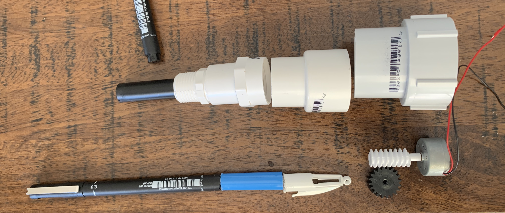

# 1701QCA Making Interaction - Assessment 2 workbook

You will use this workbook to keep track of your progress through the course and also as a process journal to document the making of your projects. The comments in italics throughout the template give suggestions about what to include. Feel free to delete those instructions when you have completed the sections.

When you have completed the template, submit the link to the GitHub Pages site for this repository as a link in Learning@Griffith. The link should be something like [https://qcainteractivemedia.github.io/1701QCA-Assessment2/](https://qcainteractivemedia.github.io/1701QCA-Assessment2/) where `qcainteractivemedia` is replaced with your GitHub username and `1701QCA-Assessment2` is replaced with whatever you called the repository this template is contained in when you set it up.

## Project working title ##
*Pen Tattoo Machine.*

## Related projects ##
*Find about 6 related projects to the project you choose. A project might be related through  function, technology, materials, fabrication, concept, or code. Don't forget to place an image of the related project in the appropriate folder and insert the filename in the appropriate places below. Copy the markdown block of code below for each project you are showing.*

### Related project 1 ###
*Geometric Drawing Mahcine*

*https://www.youtube.com/watch?v=xp7MkqE4xIw*

This project is related to mine because it shows off the basic idea of a drawing machine. The project uses similar technology to what I am planning on using for my final piece with the cogs playing a major roll in how the machine runs. This very basic and easy to build geometric drawing machine works by having two arms connected to the turning cogs moving the pen in a circular motion in doing so creating mesmerizing geometric patterns. Looking into machines like this it allowed for me to find a basic level of the technology required in order to create a project like this. With my machine however, I will have to model it more after a legitimate tattoo machine rather than a drawing machine like this. The concept as well as the technology sometimes crosses over between the two allowing me to use aspects of both. 

### Related project 2 ###
*Vibration Motor Drawing Machine*

*https://www.youtube.com/watch?v=xp7MkqE4xIw*

This machine is a DIY drawing machine that utilises a vibration motor, battery pack and pens. The machine is designed with the pens arranged together facing outwards and the motor in the middle between them all. As the motor runs the pens are shaken and moved around causing patterns and lines to be drawn on whatever surface the machine is placed on. Again, this is a very simple drawing machine but the technology used is similar to that I plan on using in my own project. By seeing how the motor could be used to move the pens in this manner, it made me think whether I could design something similar to this with the pen being driven up and down casuing the dotted effect rather than having the pens move side to side creating lines. By designing the project to be similar to this one in would eliminate the need for a cog and cam shaft driving the pen up and down but in doing so would make the project more simple and basic. Maybe there is a happy medium between the two ideas that I can begin to look into such as purchasing and testing out one of these vibration motors and testing with and without the cam shaft. Making this project I want to design it as similar to a tattoo machine as possible. In doing so not only can it be used as a drawing machine but could also be refined and produced as a machine for an apprentice to use to produce work with as practice for tattooing. I feel that the vibration motor would come in handy when trying to create a machine similar to a regular rotary tattoo machine.

### Related project 3 ###
*Drill Drawing Machine *

*https://kash1985.wordpress.com/2008/10/16/rough-drawing-machine-ideas/*

When researching different drawing machines I came across this piece which at frist was simply included because I found it quite funny and while yes it was a drawing machine it seemed like quite a joke however, the more I began to think about it the technology could actuallly be used in one way or another. The basic idea behind the piece is that a ball with pens, pencils or ink is connected to a drill and when the drill is turned on and put against a canvas the drill moves the ball creating different outcomes of lines and in term creating "art". In all honesty, the idea is pretty cool and something I had never really thought about using but the idea would work quite well if you were completing work on a larger scale and needing an automated way of doing so. If there was a way to utilise the technology of a drill to drive a pen in a back and fourth motion I could consider using this in my project however, the issues I would have in doing so would be the sheer size and power of the drill. I think that this would end up becomming a big issue for me in the future. The idea is still something I find intersting and would like to play with more in future I just think the power and size would take away from the project.

### Related project 4 ###
*Simple Tatttoo Machine *

*https://www.instagram.com/p/B-cgX_soyzV/*

These next few projects started getting me very excited. Seeing that people have played with ideas like this as well as exploring the world of these simple build tattoo machines is something that I find extremely interesting. This project was sent to me by my tattoo artist after we had a night of painting together and I had explained to him what I was currently working on at uni. The instagram page is a collection of tattoo machines built by this artist. Each machine is built from everyday materails such as hollowed out pens etc. This was like a wave of ideas after seeing this, and was actually the reason I had the idea for building my machine the way I intend to build it for the final. For example, the hollowed out pen makes for a great housing unit for a smaller pen to be used and can be swapped out for different colours or sizes. The technology used for these machines can be made or bought quite easily too making it easy for me to build. The only big difference between this machine and something I can make would be the motor size and the quality of the cam shaft/cog system. By using the Microbit it limits the power of the motor that can be used which is a shame but still allows me to create a working machine, it just won't be as powerful as those shown by this artist.

### Related project 5 ###
*Dotworker *

*https://www.instagram.com/p/B-uWJMbC-t-/*

This project is by far both my favourite and the most useful for me when designing the project. Here you can pretty much see exaclty what I am aiming to build. The project shows off this idea I've been toying with perfectly, a machine that can be used for creating dotwork projects similar to producing a tattoo. The technology used is pretty much the same as what I am trying to achieve (Although mine is much less professional). I just found this project to be everything I wanted to produce and it gave me a very well thought out, clean version of the conceptual idea I had been playing with ove the past few weeks. Surprisingly, this is the only fully developed project I found that was pretty much exactly what I was wanting to produce. In seeing this I have realsied this is a very niche market for the project I am wanting to produce, this has both good and bad qualities to it. On the plus side if the product were to go to market there would be no real competition. Then on the downside there is no telling how big or small the market for such a product is. 

### Related project 6 ###
*Pen Style Tattoo Machine *

*https://www.youtube.com/watch?v=H3Q8sdJDMog*

The final project I have chosen to include is a modern tattoo machine that is modelled after a pen to be lightweight and comfortable for the user. The design of this piece is the aspect that I had taken in the most, it's very clean and lightweight while still looking professional. In a perfect world I would have loved to create a model based upon this machine to 3D print for my project however, with the current times that just isn't possible. In saying this though I would like to produce something as similar to this machine as possible to keep the look of a tattoo machine, a lot of the drawing machines I have shown previously are modelled off of old school coil machines. They all look very heavy and would be painful to use over an extended period of time, but if they were to be modelled like this machine with a very light material for its casing it would feel no different to holding a larger marker. 

## Other research ##
*Include here any other relevant research you have done. This might include identifying readings, tutorials, videos, technical documents, or other resources that have been helpful. For each particular source, add a comment or two about why it is relevant or what you have taken from it.*

### *Brief resource name/description* ###

*T³: 3D Printing a Rotary Tattoo Machine:*
*https://www.sparkfun.com/news/2165*
*This source was a fun blog post showing how you could use a 3D printer to develop a very basic tattoo machine. I had come across this page within the first few weeks of researching this concept and was amazed that you could do such a thing, giving me the idea to 3D print elements of my project. While we may not be able to 3D print due to this current situation I still have taken elements from this source that can be used within my own project such as the build itself. The source details how to build the machine itself with each part being shown in the video, a lot of these ideas I have played with and want to use with my final piece to make sure it works in a similar way to these 3D printed machines*

*How to make your own tattoo machine:*
*https://www.vice.com/en_au/article/zmgz9x/heres-how-to-make-your-own-tattoo-machine*
*This Vice article details the many different ways you could build a DIY tattoo machine talking about the base aspects that need to be build and how you can produce these with vary simple household tools. Funnily enough, most of the machine's built within the piece could all be accomplished with things I have laying around the house. This article to me was a great way of coming up with designs of how this project was going to look, since we don't have access to a lot of the more professional equipment supplied by the university I have turned to going with the more personally built look. The machine is something produced for me and while I do want it to look clean and not as though it will fall apart within a few minutes I do want it to keep that homemade feel to it like some of the machines shown within this piece. It's honestly surprising how informative this was for me detailing each and every aspect that was needed and allowing me to come up with a very simple but effective design draft.*

*How to setup a tatoo machine:*
*https://www.youtube.com/watch?v=2WhIYi9d_yw*
*This is a basic instructional video on how to setup a tattoo machine. I've icluded this source as it showed how a machine should be setup and how I should be designing my project, by modelling the project as a legitimate machine it makes it as interactive as posible. The video also shows all the elements of a tatoo machine that I would like to try and replicate in my drawing machine, as hard as it may be to create some of these I would like to make it as close as possible to a tattoo machine.*

## Conceptual progress ##

### Design intent ###
*Design intent: To create a drawing machine that can be used by artists to both produce and speed up the process of making art.*

### Design concept 1 ###
* A pen/ink dropper connected to the micobit's servo motor that can spin the ink into patterns. Similar to the geometric drawing machines outlined earlier. You could use the same arm system as these with the servo motor driving cogs and moving the arms holding pens/ink to create the patterns* 

### Design concept 2 ###
*A wheeled robot that can move a pen around a canvas drawing lines as it moves along creating large scaled artworks. This is based upon the drawing robot shown on the microbit website. The basic idea is that a microbit is coded to move in certain patterns and a pen is attached via a piece of cardboard and wheeles. This idea can be played with endlessly with the microbit being coded to do all kinds of different things.*

### Final design concept ###
* A drawing tool emulating a tattoo machine using pens/pencils instead of needles and ink, to produce stippled work in a much easier way. *
What problem do you want to solve?

The problem I aim to solve with this drawing machine is the sheer time it takes to complete a piece of artwork by stippling or using dot work. Stippling is very much like traditional tattoo methods such as Tebori, where the artist will need to dot each piece by hand. Similar to how a tattoo machine made this easier for artists to tattoo, I would like to make a mchine for dotwork artists to not have to produce every dot by hand individually and speed up the process.

What relation do you want to form or change? What experience do you want to create?

The expierence I want to create is a feeling of joy for artists I know that if a machine like this already existed I would use it every day, there is something so time consuming about producing stippled work that will often stop me from finishing pieces.

What kinds of people will be involved in this scenario? What non-human actors/participants? What is the future scenario you imagine?

Artists would be the main target audience, the scenario I imagine is that this machine could be something for artists to use at their own will for speeding up the process of their art.

What are the start and endpoints of your path?

The start point of this project is the design ideation and sketching. From here it is a matter of testing and prototyping the idea and coming to a final usable result by the endpoint*

### Interaction flowchart ###
*Here you can see the interaction flowchart for the pen tattoo machine. The final piece will require the user to turn the potentiometer to ajust the speed the machine runs at. This will then turn the motor on and ajust it's speed therefore ajusting the speed at which the worm drive is connecting with the cog and cam shaft pushing the pen up and down.*

## Physical experimentation documentation ##

*In this section, show your progress including whichever of the following are appropriate for your project at this point.
a.	Technical development. Could be code screenshots, pictures of electronics and hardware testing, video of tests. 
b.	Fabrication. Physical models, rough prototypes, sketches, diagrams of form, material considerations, mood boards, etc.
Ensure you include comments about the choices you've made along the way.*

*You will probably have a range of images and screenshots. Any test videos should be uploaded to YouTube or other publicly accessible site and a link provided here.*

## Design process discussion ##
*After reaserching the project in depth I had a general idea of what I wanted to begin completing. The first stage of the process would be getting all the neccessary equipment this included; Buying the wormdrive, cogs, and pvc piping for the housing unit. I had already begun to encounter issues trying to find the correct sizes for all the elements I had to be ussing in order for the project to work such as the cogs and pvc pipe however, in the end I founnd sizes that would work. Once I had found the correct sizes and had all the elements back home it was time to start building and playing around. The first step for me was laying out all my elements on the table and figuring out just how I wanted it to be layed out. I arranged the pvc piping into the descending order making the larger outer housing unit for the whole project and fitted the motor and worm drive to the top, that way it was in a fixed position and I had one part completed already. The next step was melting down and sanding a few of the pieces of pipe in order to create a snug fit that wouldn't fall apart when picked up by the user. If this were to happen the whole unit would fall apart whereas on the other hand if it were all glued together it would be a one time use project and you couldn't easily maintenance it. Once this had been achieved I wanted to begin working on the pen's housing unit. At the start I had no real idea how I was going to do this to be honest becasue it would need to fit the pen in such a way that it wouldn't just fall out but at the same time wouldn't be giant and make the project bulky. I ended up cutting the top off of a 4 colour multipen for the top of the housing unit and hollowing out a black sharpie for the base with both units combined the pen fits snug between and also has enough room to be moved up and down by the cam shaft. Finally, I have wired up the motor on the breadboard and Microbit and have it working with the worm drive.*

## Next steps ##
*The next steps in order to move forward are to setup and code the potentiometer and ensure that is working with the worm drive slowing and speeding up the power of the motor. From here it is only a matter of cleaning up the housing elements and making them look more presentable and professional, then simply combining all the elements together and running some tests*
